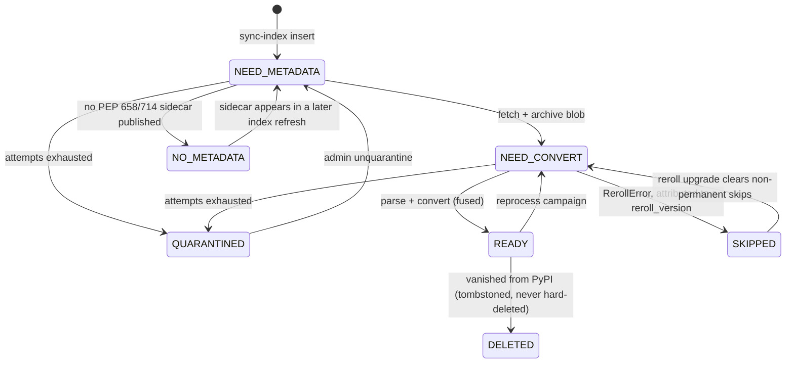
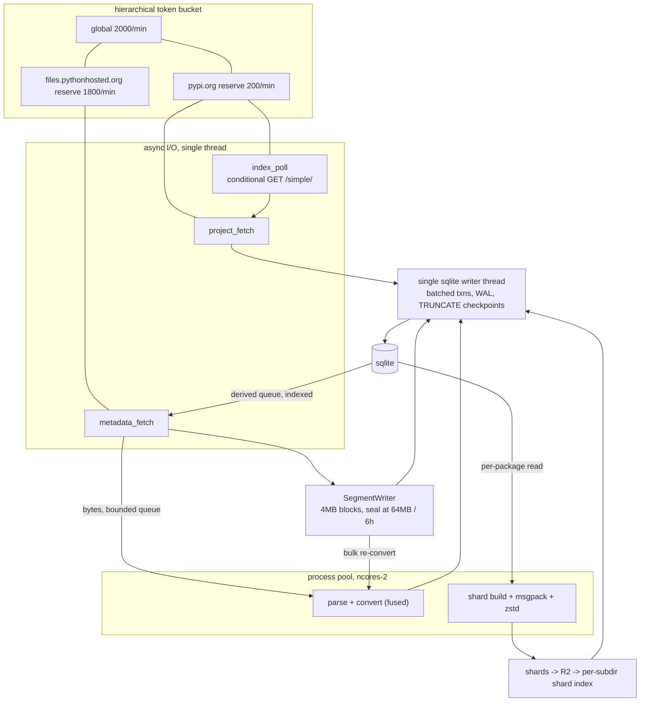

# Pipeline and daemon architecture

How reroll-sync runs as a long-lived service on one box, rather than as a
sequence of manually-invoked batch commands. Supersedes running
`sync-index` / `sync-metadata` / `parse-metadata` / `sync-reroll` as
independent CLI invocations against a shared database.

## State machine

Each `wheels` row moves through an explicit `state` (an integer column,
see `db.md`), rather than the previous approach of inferring state from
which nullable columns happened to be set.



Notes:

* **`yanked` is an attribute, not a state.** A yank flip changes what a
  wheel contributes to published repodata (excluded -- see
  `publishing.md`) without moving it out of `READY`. It does mark the
  wheel's package dirty.
* **`DELETED` is a tombstone.** `wheels.deleted_at` is set; the row is
  never removed, since `blobs`/`wheel_repodata` referencing it should
  remain resolvable for `fsck` and for historical debugging.
* Explicit `state` makes queue selection a single index seek on
  `ix_wheels_queue(state, lane, project, id)` and queue depth a bounded
  range `COUNT(*)`, instead of a full-table scan of a 12M-row table on
  every dispatcher tick. The risk this introduces -- `state` drifting from
  what the other columns actually say -- is covered by `fsck`
  (`operations.md`).

## Why parse and convert are fused

The previous design had four independent stages, with the parsed METADATA
persisted in `wheels.wheel_metadata` between the parse and convert steps.
That intermediate has been removed:

* Parsing is deterministic and takes on the order of 5 ms/wheel. Once the
  raw bytes are in the local archive (`archive.md`), there is no benefit
  to persisting the parsed form -- re-running convert alone means
  re-running parse too, at a cost cheap enough not to matter.
* Removing the intermediate removes an entire pipeline stage, an entire
  derived queue, one write per wheel, and roughly 36 GB of database size
  across the wheel corpus.

So `NEED_CONVERT -> READY` is one CPU-bound task: given raw METADATA
bytes and a filename, run `reroll.parse_metadata` then
`reroll.stages.get_wheel_records`, and return an outcome. This task has no
database access and no network access, which is what makes it safe to run
in a process pool (see "Executors" below) and trivial to unit test.

## Backoff, retries, and quarantine

`work` (`db.md`) is sparse and holds only wheels currently in trouble.
Queue selection for a stage is:

```
<state predicate for this stage> AND wheel_id NOT IN (<deferred set>)
```

where the deferred set is `work` rows with `next_attempt_at` in the future
or `quarantined_at` set, held in memory by the dispatcher since it is
expected to stay small. A transient failure (`Retry`, see "Outcomes"
below) increments `attempts`, applies exponential backoff with jitter for
`next_attempt_at`, and leaves `state` unchanged. Exceeding a configured max
attempt count sets `quarantined_at`, moving the wheel to `QUARANTINED` and
requiring `reroll-sync unquarantine` (`operations.md`) to clear it.

This is what prevents a handful of permanently-failing URLs from pinning
the head of an `ORDER BY id` queue forever, which is a live gap in the
current implementation (`except OSError: continue` with no backoff).

## Rate limiting: hierarchical, per-domain

The PyPI request budget is one hierarchical token bucket with two
reserved children:

```
global: 2000/min
  +-- pypi.org                  reserve 200/min   (index poll, project pages)
  +-- files.pythonhosted.org    reserve 1800/min  (.metadata sidecars)
```

Either child may borrow the other's idle capacity up to the global cap,
but each has a guaranteed floor. This is a structural guarantee, not a
policy one: a multi-day metadata backfill draws from a *physically
separate* reserve than index polling, so it cannot starve freshness no
matter how the scheduler is tuned.

`/simple/` is polled with a conditional GET (ETag / `If-Modified-Since`);
an unchanged index costs one small response, and `meta._last-serial`
short-circuits the outdated-project diff entirely.

## Lanes

Within the `files.pythonhosted.org` bucket, `wheels.lane` distinguishes:

* **lane 0 (incremental)**: wheels newly discovered by `sync-index`.
* **lane 1 (backfill)**: everything else -- initial backfill, and bulk
  reprocess campaigns (`operations.md`).

The fetch dispatcher pulls with a fixed floor ratio favoring lane 0 (e.g.
9:1 backfill:incremental as a floor for incremental, not a cap), so
backfill absorbs the entire remaining budget whenever the incremental lane
is empty, but newly-published wheels never wait behind a multi-day
backfill.

## Backpressure

Fetch and convert are fused into one flow, so the bytes for a fetched
`.metadata` sidecar go directly to the convert step without a round trip
through storage. This requires a **bounded** in-memory queue between the
async fetch loop and the process pool: if the CPU pool stalls (e.g. a
misbehaving reroll version hangs), fetching must stop rather than buffer
an unbounded amount of metadata in RAM. Sizing this queue is a tuning
knob, not an architectural one -- the requirement is only that it has a
ceiling.

## Executors

| Stage | Bottleneck | Executor | Concurrency |
|---|---|---|---|
| index poll | 25 MB response, latency | 1 async task | 1 |
| project fetch | `pypi.org` bucket reserve | async | ~32 in flight |
| metadata fetch | `files.` bucket reserve | async | ~64 in flight |
| parse + convert (fused) | CPU | process pool | `ncores - 2` |
| segment write | zstd compression | 1 thread per open segment | small |
| shard build + msgpack + zstd | CPU | process pool | `ncores - 2` |
| shard upload | upload bandwidth, latency | async | ~32 |
| sqlite writes | single writer | 1 thread | 1, batched |

The core insight driving this table: fetch is throttle-bound at ~33
req/s, which needs at most a handful of concurrent connections in theory
(more in practice, to absorb tail latency) and essentially no CPU. Convert
and shard-build are the only genuinely CPU-bound stages, and they are the
only ones sized against `ncores`. Do not size the fetch path for
parallelism -- it wants async I/O behind the token bucket, not a process
pool.



## Single writer, thin CLI

One process owns every write to sqlite, funneled through a single writer
thread that batches commits (roughly 1000 rows or ~100 ms, whichever comes
first). WAL mode plus a batching writer is what keeps write throughput
acceptable and the WAL bounded (see `db.md` pragmas).

Two consequences for the CLI, since admins need to be able to SSH in and
run remediation commands while the daemon is running:

* **Mutating commands** (`pause`, `resume`, `reprocess`, `unquarantine`,
  `publish-now`, ...) are thin clients over a unix domain socket to the
  running daemon. They never open the database for writing themselves.
* **Read-only commands** (`status`, `stats`, `errors`, `fsck`,
  `verify-archive`) open the database directly, read-only, using WAL's
  reader isolation -- they never block on, or are blocked by, the writer.

Workers (the fetch loop, the convert pool, the shard-build pool) return an
outcome value and touch neither the database nor any network endpoint
other than their own task. All persistence decisions -- which table to
write, whether to increment `work.attempts`, whether to mark a package
dirty -- are made centrally by the dispatcher that owns the writer thread.
This is a deliberate consolidation of the four independent copies of
`_mark_skipped` / `_record_error` / per-row `conn.commit()` that exist
today across `metadata_sync.py`, `metadata_parse.py`, and
`reroll_convert.py`.

### Outcomes

```
Ok(...)          -- succeeded; dispatcher advances state and writes the payload
Terminal(reason)  -- the wheel's fault; dispatcher writes to `skips` and advances
                     state accordingly (permanent or reroll_version-attributed)
Retry(reason)     -- transient; dispatcher writes/updates a `work` row with backoff
RateLimited       -- dispatcher requeues without counting it as an attempt
```

This also fixes a currently-silent failure mode: the existing code has
several `except OSError: continue` sites that make zero forward progress
on a wheel indefinitely while `stats` reports the run as having
"succeeded." Under the outcome model, that failure becomes a `Retry`,
visibly increments `work.attempts`, and eventually becomes visible via
`quarantined` counts if it never clears.

## Rules that must hold structurally, not just in the happy path

* **No read transaction may run longer than ~250 ms.** A checkpoint cannot
  advance past the oldest active reader, so a leaked long-lived reader is
  the *only* way the WAL can grow unbounded. A watchdog logs (and, in
  tests, fails) any transaction that exceeds this, including read-only CLI
  commands.
* **Publishing never holds a long read transaction.** See `publishing.md`
  for the per-package snapshot discipline this requires.
* **The fetch->convert queue is bounded.** See "Backpressure" above.
* **Circuit breakers are per-dependency**, not global: if R2 is
  unreachable, the daemon pauses publishing only -- index sync, fetching,
  and converting continue unaffected. Likewise a `pypi.org` outage should
  not stop `files.pythonhosted.org` fetches already past that point in the
  pipeline.
