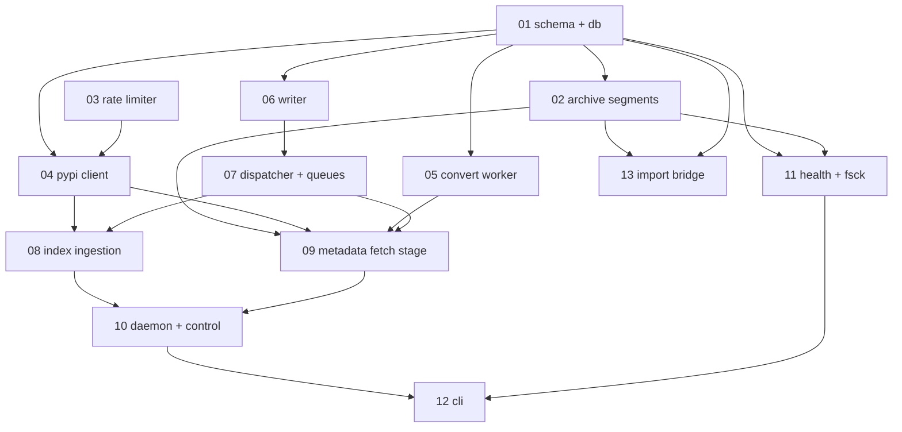

# reroll-sync implementation specs

One task per file. Each spec is self-contained enough that an agent can pick
it up cold, with no memory of the design conversation, and finish it.

`docs/*.md` describes the **end-state architecture**. These specs describe the
**phased path to it**, and Phase 1 deliberately builds only part of that
end state. Where a spec omits something `docs/` describes, the spec says so
explicitly under "Deferred". A mismatch between `docs/` and the code during
Phase 1 is expected and is not a bug.

Never edit `docs/*.md`. See `AGENTS.md`.

## Phase boundary

Phase 1 gets the ingestion queue running end to end and fully populates the
database. It stops short of publishing.

**In scope for Phase 1**

- PyPI simple-index polling, project-page ingestion, deletion + yank handling
- Rate limiting across PyPI domains
- `.metadata` fetching, verification, and archival into local zstd segments
- Fused parse+convert with pre-release retry, writing `wheel_repodata`
- The daemon: stage loops, single sqlite writer, backoff, quarantine,
  circuit breakers, control socket
- Health, `fsck`, `verify-archive`, CLI

At the end of Phase 1 the database contains repodata records for every
convertible wheel on PyPI, kept current automatically.

**Deferred to Phase 2 (publishing)**

- Shard generation (msgpack + zstd), the per-subdir shard index
- Any R2 / object-storage upload. **`r2_client.py` is deleted in Phase 1**
  and `boto3` is dropped from dependencies; both return in Phase 2.
- The `dirty_packages`, `shard_index`, and `objects` tables from
  `docs/db.md` are **not created** in Phase 1. `wheels.change_seq` plus an
  index on it is sufficient to answer "what changed since seq N" when
  Phase 2 arrives.
- CDN cache headers and purge (Phase 3, per `docs/publishing.md`)
- `repodata.json` — dropped permanently. Sharded repodata only.

One table exists in Phase 1 that `docs/db.md` does not describe:
`unlinked_blobs`, which spec 13 needs for the bulk import and spec 08 drains
as wheels appear. Surface it to the owner as a doc addition; do not edit
`docs/db.md`.

## Dependency graph

`03` and `05` have no dependency on each other or on anything but `01`, so
they can be done in parallel with the early work. `05` is the highest-value
early task: it is a pure function with no I/O, and it is where the
pre-release behaviour lives.

## Invariants that apply to every task

These are not restated in each spec. Violating one is a review failure even
if the spec's own acceptance criteria are met.

1. **Tests before code.** Every edge case gets a failing unit test first.
   See `AGENTS.md` — this is not optional, and exploratory `python -c` runs
   against dependencies or existing code are not a substitute for a test.
2. **100% coverage, zero suppressions.** No `# pragma: no cover`,
   `# type: ignore`, `# ty: ignore`, or `# noqa`. An uncoverable line means
   the code is unreachable (delete it) or untested (test it).
3. **One sqlite writer.** Only the writer thread from spec `06` issues
   writes at runtime. Bulk/offline tools may write only with the daemon
   stopped.
4. **No read transaction may exceed ~250 ms.** A checkpoint cannot advance
   past the oldest active reader, so a long reader is the only way the WAL
   can grow without bound. Use keyset-paginated chunked reads. Spec `06`
   provides the watchdog; every read path must stay under it.
5. **Workers never write.** A worker returns an outcome value; the
   dispatcher decides what it means and the writer persists it. No module
   outside `06` calls `conn.commit()`.
6. **Never `SELECT` an unbounded result set into memory.** Always
   `WHERE id > ? ... LIMIT ?`. The tables reach 12M+ rows.
7. **Threads, not asyncio.** I/O stages use bounded `ThreadPoolExecutor`s,
   CPU stages use `ProcessPoolExecutor`, handoff is via bounded
   `queue.Queue`. Rejected asyncio deliberately: 64 threads is cheap at
   33 req/s, and threads avoid event-loop/process-pool interaction hazards
   and make deterministic testing with injected clocks much simpler.
8. **All clocks and all I/O are injectable.** Every module that reads time
   takes a `now: Callable[[], float]` or equivalent. No test may sleep.
9. **Module docstrings are one or two lines.** Public functions first,
   private helpers at the bottom. No history, no rationale-in-comments —
   that goes in the commit message.
10. **`make ci` passes.** `make format` does all formatting; never hand-wrap
    lines.

## Scale figures worth keeping in mind

Design decisions in these specs follow from these numbers. If a change
seems gratuitously careful, it is because of one of them.

| Quantity | Value |
|---|---|
| PyPI projects | ~650k |
| Wheels | ~12M |
| Raw METADATA corpus | ~60 GB (confirm via source `SUM(n_bytes)`) |
| Distinct METADATA bodies | ~11.9M — ~1% of files are byte-identical across wheels |
| Existing corpus compression | per-body zlib-6, measured 2.81x |
| Segmented + zstd target | beat 2.81x substantially; ≥ 4x |
| PyPI request budget | 2,000/min total |
| Cold-start project pages | ~5.5 h |
| Cold-start metadata fetch, if from PyPI | ~3.5 days |
| Cold start using the existing corpus | ~8 h |
| Convert 12M wheels, 16 cores | ~1 h |
| Target total sqlite size | ~13 GB |
| Server disk, shared with other services | 160 GB |
| Hard cap on uncompressed-at-rest data | 20 GB |

## Current-code disposition

Every existing module is touched. Summary; each spec restates its own part.

| Module | Fate | Spec |
|---|---|---|
| `schema.py` | Rewritten | 01 |
| `db.py` | Rewritten | 01 |
| `version.py` | Kept as-is | — |
| `pypi_client.py` | Rewritten | 04 |
| `metadata_download.py` | **Deleted**, folded into `pypi_client` | 04 |
| `metadata_sync.py` | **Deleted**, replaced by fetch stage + archive | 09 |
| `metadata_parse.py` | **Deleted**, folded into convert worker | 05 |
| `reroll_convert.py` | **Deleted**, folded into convert worker | 05 |
| `r2_client.py` | **Deleted**, returns in Phase 2 | — |
| `sync.py` | Rewritten as ingestion | 08 |
| `stats.py` | Rewritten as health | 11 |
| `cli.py` | Rewritten | 12 |

New: `archive/`, `ratelimit.py`, `convert.py`, `writer.py`, `dispatcher.py`,
`ingest.py`, `fetch.py`, `daemon.py`, `control.py`, `health.py`, `fsck.py`.

## Dependency changes

Add: `httpx` (connection pooling + HTTP/2, replaces `urllib.request`),
`zstandard`. Dev: `pytest-mock` if useful; no async test plugin needed.

Remove: `boto3` (returns in Phase 2).

Keep: `py-reroll`, `frozendict`.
